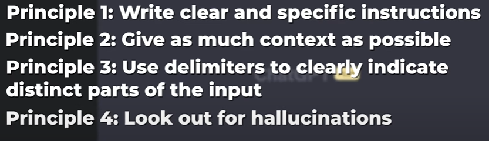

# AI prompting

1. Tinker
   1. Pinpointing an error and craft better error
2. Ask your AI
   1. chatgpt
   2. phind
   3. Principles to best prompt
      1. 
      2. what is hallucination
         1. output is completely wrong but output is given
      3. Understand limitations
      4. iterate and improve
3. Read docs and utilize that for AI
4. Web search and utilize that..
   1. phind uses AI + google search
5. Ask in a forum
   1. stack-exchange reddit
6. Format them in markdown
7. Ask support on github
   1. is the code open sourced
8. Iterate

## Specific tips

1. Limit self-triage to 15-20 minutes
   1. don't mess around for more than 15 to 20 minutes
2. Don't be afraid to ask AI but don't skip learning
   1. when we learn under the hood we can identify hallucinations.
3. Use the forums
   1. web3.dev
   2. foundry-full-course-f23
4. Google the exact error
5. Post in stack exchange or peeranha
   1. use the stack exchange context and utilize AI both

## formatting Github questions

1. Poorly formatted question
   1. Poor formatting
   2. wrong markdown
2. Correct formatting
   1. Receiving the error and specific
   2. markdown and specify error
   3. Copy the line that is showing error
   4. last formal line
3. Should be formatted as AI might need it not too long the code
4. post the relevant code
5. `solidity` will add formatting

## Speedrun ethereum

1. how and why??
2. utilize it post course is finished
3. finish the quests
4. scaffold/eth
